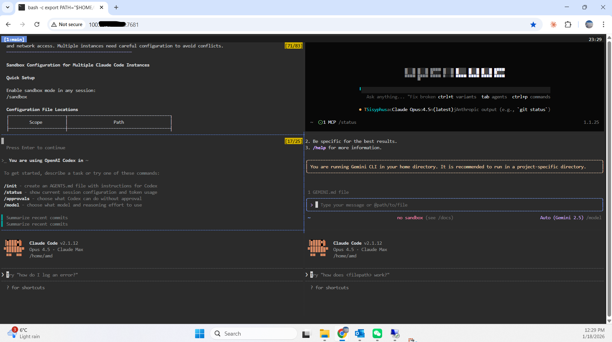
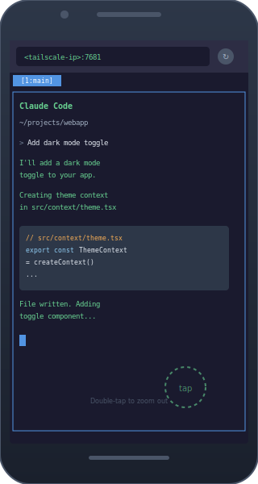
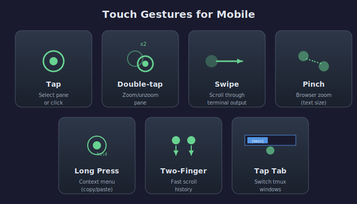
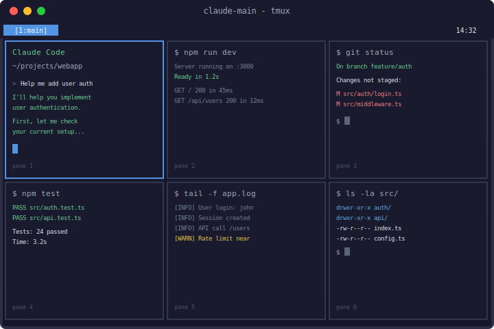

<p align="center">
  
</p>

# Vibe Coding Setup

**Access Claude Code from your phone, tablet, or any device with a web browser.**

A complete setup for persistent Claude Code sessions accessible via web terminal - perfect for mobile coding, remote access, and couch-based development.

<p align="center">
  
</p>

## Features

- **Mobile-first**: Touch-friendly tmux configuration with tap/swipe gestures
- **Persistent sessions**: Claude keeps running even when you disconnect
- **Secure access**: Only accessible via Tailscale VPN (not exposed to internet)
- **Auto-start**: Sessions survive reboots via systemd
- **Multi-pane layout**: 3x2 grid with Claude in top-left, 5 extra shells

## Architecture

<p align="center">
  
</p>

<details>
<summary>ASCII diagram (text version)</summary>

```
+------------------+          +-------------------+          +------------------+
|                  |   VPN    |                   |   Web    |                  |
|   Your Phone     |--------->|    Tailscale      |--------->|   Your Server    |
|   (Browser)      |          |    Network        |          |   (ttyd+tmux)    |
|                  |          |                   |          |                  |
+------------------+          +-------------------+          +------------------+
        |                                                            |
        |                                                            v
        |                                                    +-------+-------+-------+
        |                                                    |       |       |       |
        |                                                    | Claude|  sh2  |  sh3  |
        +---------------------------------------------------->       |       |       |
                      http://100.x.x.x:7681                  +-------+-------+-------+
                                                             |       |       |       |
                                                             |  sh4  |  sh5  |  sh6  |
                                                             |       |       |       |
                                                             +-------+-------+-------+
```
</details>

### How It Works

1. **ttyd** serves a web terminal on port 7681
2. **tmux** provides persistent sessions with multiple panes
3. **Tailscale** secures access (only your devices can connect)
4. **systemd** keeps everything running after reboots

## Quick Start

```bash
# One-click install
curl -fsSL https://raw.githubusercontent.com/rockyco/vibe-coding-setup/main/install.sh | bash

# Or clone and run locally
git clone https://github.com/rockyco/vibe-coding-setup.git
cd vibe-coding-setup
./install.sh
```

After installation, access from your phone:
1. Install Tailscale on your phone
2. Open browser to `http://<your-tailscale-ip>:7681`
3. Start coding!

### Getting Your Tailscale IP

> **Important**: Tailscale must be installed on BOTH your server AND your phone/tablet.

**On your server**, run:
```bash
tailscale ip -4
```

This returns your server's Tailscale IP address (e.g., `100.x.x.x`). Use this IP to connect from any device on your Tailscale network.

**On your phone/tablet**:
- **iOS**: [Download Tailscale from App Store](https://apps.apple.com/app/tailscale/id1470499037)
- **Android**: [Download Tailscale from Play Store](https://play.google.com/store/apps/details?id=com.tailscale.ipn)

Sign in with the same account you used on your server. Once connected, open your mobile browser and navigate to `http://<your-tailscale-ip>:7681`.

## Prerequisites

| Requirement | Purpose | Install Command |
|------------|---------|-----------------|
| Linux with systemd | Service management | (most distros) |
| tmux | Terminal multiplexer | `sudo apt install tmux` |
| ttyd | Web terminal | See below |
| Tailscale | Secure VPN | `curl -fsSL https://tailscale.com/install.sh \| sh` |
| Claude Code | AI coding assistant | `npm install -g @anthropic-ai/claude-code` |

### Installing ttyd

```bash
# Ubuntu/Debian
sudo apt install ttyd

# Or build from source
git clone https://github.com/tsl0922/ttyd.git
cd ttyd && mkdir build && cd build
cmake .. && make && sudo make install
```

## Manual Installation

### 1. Install the session management scripts

```bash
# Create bin directory
mkdir -p ~/bin

# Copy scripts
cp config/claude-session ~/bin/
cp config/claude-web ~/bin/

# Make executable
chmod +x ~/bin/claude-session ~/bin/claude-web

# Add to PATH (add to .bashrc)
echo 'export PATH="$HOME/bin:$PATH"' >> ~/.bashrc
source ~/.bashrc
```

### 2. Install tmux configuration

```bash
# Backup existing config
[ -f ~/.tmux.conf ] && mv ~/.tmux.conf ~/.tmux.conf.backup

# Install mobile-friendly config
cp config/tmux.conf ~/.tmux.conf
```

### 3. Set up systemd services (auto-start)

```bash
# Create user systemd directory
mkdir -p ~/.config/systemd/user

# Copy service files
cp config/systemd/claude-tmux.service ~/.config/systemd/user/
cp config/systemd/ttyd.service ~/.config/systemd/user/

# Edit ttyd.service to fix the PATH for your system
# Update the node path to match your installation
nano ~/.config/systemd/user/ttyd.service

# Enable and start services
systemctl --user daemon-reload
systemctl --user enable claude-tmux.service ttyd.service
systemctl --user start claude-tmux.service ttyd.service

# Enable lingering (services run even when logged out)
sudo loginctl enable-linger $USER
```

### 4. Configure Tailscale

```bash
# Install Tailscale
curl -fsSL https://tailscale.com/install.sh | sh

# Authenticate
sudo tailscale up

# Get your Tailscale IP
tailscale ip -4
```

### 5. Verify the setup

```bash
# Check services are running
systemctl --user status claude-tmux.service
systemctl --user status ttyd.service

# Check the URL
echo "Access at: http://$(tailscale ip -4):7681"
```

## Accessing from Mobile

### Phone/Tablet Setup

1. **Install Tailscale** on your device from App Store or Play Store
2. **Sign in** with the same account as your server
3. **Open browser** and go to `http://<tailscale-ip>:7681`
4. **Bookmark** the URL for quick access

### Touch Gestures Reference

<p align="center">
  
</p>

| Gesture | Action |
|---------|--------|
| Tap | Click / Select pane |
| Double-tap | Zoom pane (toggle fullscreen) |
| Swipe | Scroll through output |
| Long press | Open context menu |
| Pinch | Zoom text (browser native) |

### Mobile Tips

- **Landscape mode**: Better for the 3x2 layout
- **Bookmark**: Add to home screen for app-like experience
- **Keyboard**: Use an external Bluetooth keyboard for heavy typing
- **Double-tap pane**: Zooms Claude pane to fullscreen

## Accessing from Another Computer

### Via SSH

```bash
# SSH to your server and attach to session
ssh yourserver
tmux attach -t claude-main
```

### Via Web Browser

Open `http://<tailscale-ip>:7681` in any browser on your Tailscale network.

## Command Reference

### claude-session

```bash
claude-session              # Attach to default session (claude-main)
claude-session project      # Attach to claude-project
claude-session -l           # List all claude sessions
claude-session -k           # Kill default session
claude-session -k project   # Kill claude-project
claude-session -n test      # Create claude-test without attaching
claude-session -r           # Recreate default session (fresh 6-pane layout)
```

### iOS Keyboard Support

This setup replaces the standard tmux prefix (`Ctrl+B`) with a single quote (`'`), making all tmux operations accessible on iOS where Ctrl and Tab keys are unavailable.

**How it works:**
1. Press `'` (single quote) as the prefix key
2. Press the action key within 1 second

Example: To interrupt a running command, type `'c` (single quote, then c).

#### Control Key Alternatives

| Keys | Equivalent | Purpose |
|------|------------|---------|
| `'c` | Ctrl+C | Interrupt running command |
| `'d` | Ctrl+D | EOF / exit shell |
| `'l` | Ctrl+L | Clear screen |
| `'z` | Ctrl+Z | Suspend process |
| `'a` | Ctrl+A | Beginning of line |
| `'e` | Ctrl+E | End of line |
| `'k` | Ctrl+K | Kill to end of line |
| `'u` | Ctrl+U | Kill to beginning of line |
| `'w` | Ctrl+W | Delete word backward |
| `'r` | Ctrl+R | Reverse search history |

#### Tab and Navigation

| Keys | Equivalent | Purpose |
|------|------------|---------|
| `'t` | Tab | Shell completion |
| `'T` | Shift+Tab | Reverse completion |
| `'[` | Escape | Escape key |
| `'i` | Up arrow | Previous command |
| `'o` | Down arrow | Next command |
| `'b` | Left arrow | Move cursor left |
| `'f` | Right arrow | Move cursor right |

#### Tmux Operations

| Keys | Purpose |
|------|---------|
| `'C` | New window |
| `'N` / `'P` | Next / Previous window |
| `'W` | Choose window (interactive) |
| `'v` | Split pane vertically |
| `'s` | Split pane horizontally |
| `'H/J/K/L` | Navigate panes (vim-style) |
| `'Z` | Zoom pane toggle |
| `'X` | Kill pane |
| `'D` | Detach session |
| `'p` | Popup terminal (80% screen) |
| `'g` | Git popup (lazygit or status) |
| `''` | Type literal single quote |

#### Copy and Paste

| Keys | Purpose |
|------|---------|
| `'Enter` | Enter copy mode |
| `'V` | Paste from tmux buffer |
| `'Y` | Show buffer in popup (for manual copy) |

**Note**: These bindings work on both iOS and laptop - no need to remember different shortcuts.

## The 6-Pane Layout

The default layout creates a 3x2 grid:

<p align="center">
  
</p>

<details>
<summary>ASCII diagram (text version)</summary>

```
+-------------------+-------------------+-------------------+
|                   |                   |                   |
|      Pane 1       |      Pane 2       |      Pane 3       |
|   (Claude Code)   |     (shell)       |     (shell)       |
|                   |                   |                   |
+-------------------+-------------------+-------------------+
|                   |                   |                   |
|      Pane 4       |      Pane 5       |      Pane 6       |
|     (shell)       |     (shell)       |     (shell)       |
|                   |                   |                   |
+-------------------+-------------------+-------------------+
```
</details>

**Why 6 panes?**
- Pane 1: Claude Code - your AI assistant
- Pane 2-3: Running servers, watching logs, tests
- Pane 4-6: Git operations, file navigation, ad-hoc commands

## Troubleshooting

### Known iOS Safari Limitations

#### Touch Screen Copy Does Not Work

iOS Safari blocks the Clipboard API for security. The copy chain (tmux -> ttyd -> xterm.js -> browser -> iOS clipboard) breaks at the browser level.

**Workarounds:**
1. **Manual selection**: Touch and hold text, use iOS native "Copy" from context menu
2. **Copy mode**: `'Enter` to enter copy mode, use `v` to select, `y` to yank to tmux buffer, then `'V` to paste within terminal
3. **View buffer**: `'Y` shows the tmux buffer in a popup - you can manually select and copy from there

**For full clipboard integration**: Use SSH from a native terminal app (like Termius or Blink) instead of the web terminal.

#### iOS Spacebar Arrow Simulation Does Not Work

The iOS "long-press spacebar and drag" trackpad feature does not work in web terminals. This feature only works in native iOS apps - the browser intercepts touch events.

**Use these instead:**
- `'i` / `'o` for Up/Down (command history)
- `'b` / `'f` for Left/Right (cursor movement)
- `'a` / `'e` for beginning/end of line

### Service won't start

```bash
# Check service logs
journalctl --user -u ttyd.service -f

# Verify ttyd is installed
which ttyd

# Check Tailscale is connected
tailscale status
```

### Can't connect from phone

1. Verify Tailscale is running on both devices
2. Check `tailscale status` shows both devices
3. Try pinging your server: `ping <tailscale-ip>`
4. Verify the service: `curl http://localhost:7681`

### Session not persisting

```bash
# Ensure lingering is enabled
sudo loginctl enable-linger $USER

# Check services are enabled
systemctl --user is-enabled ttyd.service
```

### Pane layout looks wrong

```bash
# Recreate session with fresh layout
claude-session -r
```

## Customization

### Changing the number of panes

Edit `~/bin/claude-session` and modify the `create_session()` function:

```bash
# For 4 panes (2x2 grid):
# Remove the third split in each row
```

### Different port

Edit `~/.config/systemd/user/ttyd.service`:

```ini
ExecStart=/usr/bin/ttyd --port 8080 --interface tailscale0 ...
```

Then reload:

```bash
systemctl --user daemon-reload
systemctl --user restart ttyd.service
```

### Adding authentication

ttyd supports basic auth:

```bash
ttyd --port 7681 --credential user:password ...
```

Or use Tailscale ACLs for more granular control.

### Theming tmux

Edit `~/.tmux.conf` to customize colors:

```bash
# Dark blue theme
set -g status-style 'bg=#1a1a2e fg=#eaeaea'
set -g pane-active-border-style 'fg=#5294e2'

# Green theme
set -g status-style 'bg=#1d3d1d fg=#98fb98'
set -g pane-active-border-style 'fg=#32cd32'
```

## Security Considerations

- **Tailscale-only**: The web terminal binds to `tailscale0` interface only
- **No public exposure**: Not accessible from the internet
- **VPN encryption**: All traffic encrypted via WireGuard (Tailscale)
- **Optional auth**: Can add password protection to ttyd

## Contributing

Pull requests welcome! Areas for improvement:

- [ ] Mobile keyboard shortcuts
- [ ] Alternative layouts
- [ ] iOS Shortcuts integration
- [ ] Android automation

## License

MIT License - see LICENSE file.

## Credits

Built with:
- [ttyd](https://github.com/tsl0922/ttyd) - Web terminal
- [tmux](https://github.com/tmux/tmux) - Terminal multiplexer
- [Tailscale](https://tailscale.com) - Zero-config VPN
- [Claude Code](https://claude.com/claude-code) - AI coding assistant
